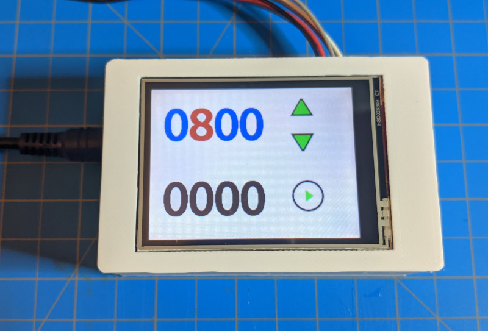
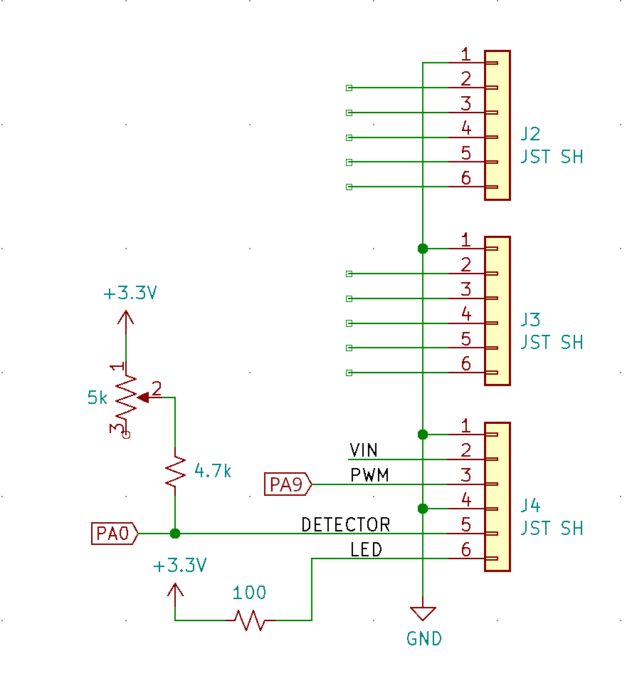
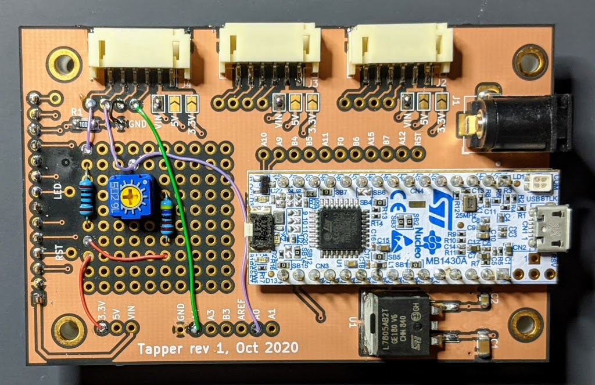

# spincoater-controller

Simple spincoater controller, written in C++ for the STM32 and
[Tapper](https://github.com/mcbridejc/tapper) board.

## What it does

It provides a touchscreen UI for speed control with a quadcopter motor and a
custom STSPIN based motor controller (or alternatively, a hobby ESC). I
made it for a spin coater, but really it's more general than that.
It reads a tachometer pulse from a reflective optical sensor to get
RPM, and drives a PWM to a hobby ESC to regulate the motor speed. More info on
the spincoater design are in [this repo](https://github.com/mcbridejc/spincoater).

## Checkout and build

You'll need: the arm gcc toolchain, OpenOCD, and lbuild. See the
[modm installation guide](https://modm.io/guide/installation/) for detailed
instructions.

`git clone ssh://git@github.com/mcbridejc/spincoater-controller --recursive`

`lbuild build` to generate the modm libraries

`make` to compile

`make program` to download via the built-in STLink and OpenOCD.

## Hardware

### Tapper

This project runs on the [Tapper](https://github.com/mcbridejc/tapper), and the
tapper board requires some simple modifications to add some resistors and
connect GPIOs.

### Motor Controller

My recommended motor controller -- at least for the spin coater application -- is this
[firmware](https://github.com/mcbridejc/stspin-bldc-rs) running on an ST evaluation board
(STEVAL-ESC002V1). This controller does open-loop control which works quite well for this
application because the load is small and predictable. This allows the use of sensorless motors --
e.g. all of the cheap RC plane/quadcopter motors out there -- with more reliable low-speed control.

You can also use hobby RC ESCs, like the ones sold for quadcopters or RC airplanes, but I have found
that using these is tricky. They are designed to run sensorless at higher speeds, and it is
sometimes a struggle to run them below (or even at) 1000 RPM; their open-loop start alone may exceed
this speed before they ever switch into bEMF sensing for commutation.

## Embedded image updates

The UI uses a few bitmaps for buttons. These are created in Gimp and saved in
the PPM format. The `images/convert_images.py` python script converts them
to header files. The header files are committed, so this only needs to be done
if images are added or changed.

The images are stored uncompressed in full color, so they can get rather big
quickly. If flash becomes scarce, some compression may be in order. I suspect
a simple run-length compression would go a long way.

## Change Log

### Jul 29, 2022

Updates to support the stspin motor controller, which is controlled via a UART
instead of a PWM signal. It provides more reliably control than typical RC ESCs,
especially at lower RPMs.

- The motor control pin is moved from A4 to A9, in order to support a UART TX
and timer output channel on the same pin.
- Can continue to support PWM controlled RC by defining `PWM_ESC_CONTROL` in
main.cpp.
